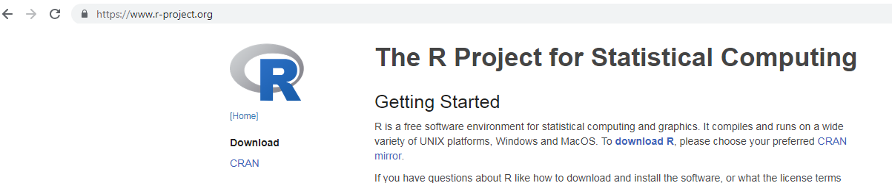
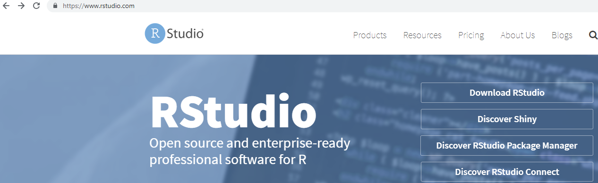

# Taller de R para mujeres

Esta actividad...

- Se enmarca en la conmemoración del **Día Internacional de la Mujer Trabajadora #8M**

- Ha sido impulsada por la **agenda de género** de COES

- Es coordinada en conjunto con el **equipo de comunicaciones** y las **asistentes de investigación** de COES

- Se realiza por tercer año consecutivo


---
# Taller de R para mujeres
## Docentes

<br>
.center[
.content-box-green[Monica Gerber]  .content-box-grey[monica.gerber@udp.cl] <br><br>
.content-box-purple[Facultad de Psicología] .content-box-blue[Universidad Diego Portales]
<br><br><br><br>
.content-box-blue[Valentina Andrade]  .content-box-purple[valentinaandrade@uchile.cl] <br><br>
.content-box-grey[Escuela de Sociología] .content-box-green[Universidad de Chile]]


---
# Programa
## Contenidos

- **Primer bloque**: Introducción (Monica)
    - 09:00 a 10:00: Introducción: ¿Qué es R?
    - 10:00 a 10:45: Cargar paquetes, revisar ayuda, cargar bases de datos
    
      10:45 a 11:15: Recreo

- **Segundo bloque**: Manipulación y análisis de datos (Valentina)
    - 11:15 a 12:15: Manipulación de datos
    - 12:15 a 13:00: Análisis de datos

---
# Introducción a R
## ¿Qué es R?

- Lenguaje de programación que se utiliza para analizar datos<br><br>
- Proyecto colaborativo en el cual los usuarios diseñan nuevas aplicaciones y herramientas 
<br><br>

<center>
```{r, out.width = "40%",echo=F, cache=T}

```
</center><br><br>
---
# Introducción a R 
## ¿Por qué usar R?

- Software gratuito y colaborativo

- Mayor variedad de herramientas para análisis estadísticos que SPSS
    - Por ejemplo, estas láminas fueron hechas con R Markdown
    
- Comunidad activa - gran ayuda online

---
# Introducción a R 
## ¿Por qué usar R?

- Mayor flexibilidad y control en el trabajo que se realiza
    - Por ejemplo, es posible ir guardando los resultados de los análisis para usarlos en análisis posteriores
    
- Puede parecer difícil de usar, pero no lo es necesariamente. Es un poco más lento de aprender al comienzo, pero luego es fácil extender a otras aplicaciones

- Uso de sintaxis para procesar datos promueve la replicabilidad, eficiencia y el control
---


# Introducción a R 
## ¿Cómo funciona R?

<center>
```{r, out.width = "50%",echo=F, cache=T}
knitr::include_graphics("img/imagen1.png")
```
</center><br><br>

- Instalación de R y RStudio
- **RStudio**: máscara para visualizar R, facilita su uso
---
# Introducción a R 
## Instalación de R y RStudio

<center>
```{r, out.width = "90%",echo=F, cache=T}

```
<br><br>
```{r, out.width = "90%",echo=F, cache=T}

```
</center>

---
# Introducción a R 
## Entorno de RStudio

<center>
```{r, out.width = "90%",echo=F, cache=T}
knitr::include_graphics("img/imagen2.png")
```
</center><br><br>
---
# Introducción a R 
## Entorno de RStudio

- R funciona por medio de funciones y objetos (datos, variables, resultados de análisis, entre otros)
- R funciona como un entorno de trabajo donde el usuario puede **correr comandos** y **agregar objetos**
- Entorno de trabajo, con todos sus objetos, puede ser guardado como R.Data
- R utiliza una sintaxis que  en general tiene un formato estándar y simple:<br>

```{r, eval=F}
funcion(argumento1 = x, argumento2 = 2, argumento3 = TRUE)
```
<br><br>

- Podemos correr la sintaxis...
    - En el entorno de trabajo (después de >) 
    - Desde el editor de sintaxis poniendo el cursor encima del texto y marcando Ctrl + Enter o Ctrl + R

---
# Introducción a R 
## Correr comandos
    
- Para solicitar ayuda sobre la función "summary":

```{r, eval=F}
help(summary)
```

```{r, eval=F}
?summary
```

- Para usar R como calculadora:

```{r, eval=T}
1/10
```
---
# Introducción a R 
## Objetos

- Objetos pueden ser: vectores (colección simple de números), matrices, factores, listas, bases de datos<br><br>
- Para crear un vector, guardarlos en el entorno y luego imprimirlos:

```{r, eval=T}
vector1 <- c(5, 6, 4, 3, 3, 1)
```

```{r, eval=T}
vector1 
```
---
class: center, middle 

# ¡Ahora a aprender haciendo!

Abre RStudio

Abre el archivo 01intro_R.R

