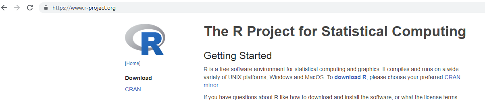
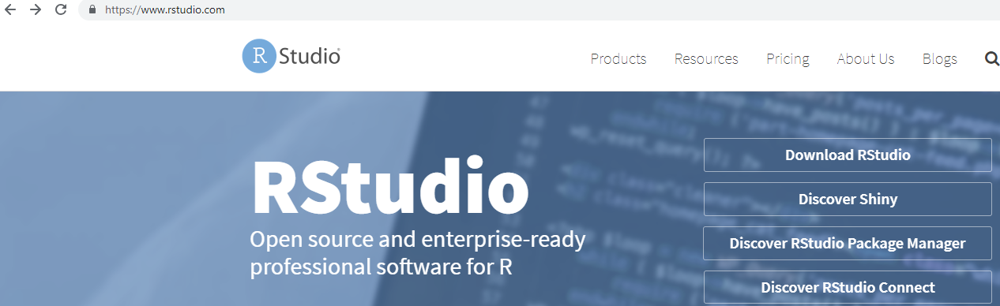
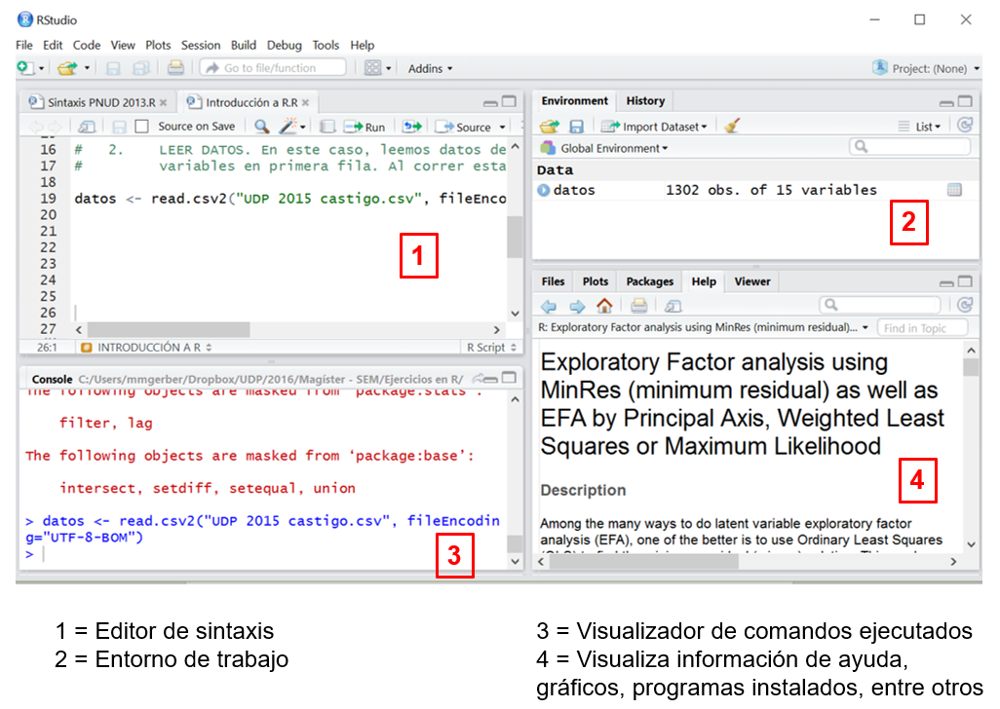

## Programa | **Contenidos**

1. Introducción: ¿qué es R?
2. Cargar paquetes, ayuda
3. Cargar y explorar base
4. Manipulación de datos
5. Análisis de datos

## Introducción a R | **¿Qué es R?**

- Lenguaje de programación que se utiliza para analizar datos<br><br>
- Proyecto colaborativo en el cual los usuarios diseñan nuevas aplicaciones y herramientas 
<br><br>

<center>
```{r, out.width = "40%",echo=F, cache=T}
knitr::include_graphics("img/imagen0.jpg")
```
</center><br><br>

## Introducción a R | **¿Por qué usar R?**

- Software gratuito y colaborativo
- Mayor variedad de herramientas para análisis estadísticos que SPSS
    - Por ejemplo, estas láminas fueron hechas con R Markdown
- Comunidad activa - gran ayuda online
- Mayor flexibilidad y control en el trabajo que se realiza
    - Por ejemplo, es posible ir guardando los resultados de los análisis para usarlos en análisis posteriores
- Puede parecer difícil de usar, pero no lo es necesariamente. Es un poco más lento de aprender al comienzo, pero luego es fácil extender a otras aplicaciones
- Uso de sintaxis para procesar datos promueve la replicabilidad, eficiencia y el control


## Introducción a R | **¿Cómo funciona R?**

<center>
```{r, out.width = "50%",echo=F, cache=T}

```
</center><br><br>

- Instalación de R y RStudio
- **RStudio**: máscara para visualizar R, facilita su uso

## Instalación de R y RStudio

<center>
```{r, out.width = "90%",echo=F, cache=T}

```
<br><br>
```{r, out.width = "90%",echo=F, cache=T}

```
</center>


## Introducción a R | **Entorno de RStudio**

<center>
```{r, out.width = "70%",echo=F, cache=T}

```
</center><br><br>

## Introducción a R | **Entorno de RStudio**

- R funciona por medio de funciones y objetos (datos, variables, resultados de análisis, entre otros)<br><br>
- R funciona como un entorno de trabajo donde el usuario puede **correr comandos** y **agregar objetos**<br><br>
- Entorno de trabajo, con todos sus objetos, puede ser guardado como R.Data
- R utiliza una sintaxis que  en general tiene un formato estándar y simple:<br>

```{r, eval=F}
funcion(argumento1 = x, argumento2 = 2, argumento3 = TRUE)
```
<br><br>

- Podemos correr la sintaxis...
    - En el entorno de trabajo (después de >) 
    - Desde el editor de sintaxis poniendo el cursor encima del texto y marcando Ctrl + Enter o Ctrl + R


## Introducción a R | **Correr comandos**
    
- Para solicitar ayuda sobre la función "summary":

```{r, eval=T}
help(summary)
```

```{r, eval=T}
?summary
```

- Para usar R como calculadora:

```{r, eval=T}
1/10
```

## Introducción a R | **Objetos**

- Objetos pueden ser: vectores (colección simple de números), matrices, factores, listas, bases de datos<br><br>
- Para crear un vector, guardarlos en el entorno y luego imprimirlos:

```{r, eval=T}
vector1 <- c(5, 6, 4, 3, 3, 1)
```

```{r, eval=T}
vector1 
```

<br><br>
- Hoy foco en bases de datos <br>

- Para agregar una base de datos como objeto en el entorno, asignamos “DatosELSOC2” al objeto “datos”:

```{r, eval=F}
datos <- read.csv("DatosELSOC2.csv")
```

<br>

## Introducción a R | **Paquetes**

- R cuenta con un programa base de comandos, que incluye las funciones básicas<br><br>
- Dependiendo de los análisis que quieran hacerse, deben irse instalando paquetes específicos<br><br>
- Por ejemplo:
    - Usaremos el paquete “haven” para importar bases de datos desde SPSS<br><br>
- Todos estos paquetes son gratuitos y se instalan directamente en R
- La primera vez que se usan deben instalarse:

```{r, eval=F}
install.packages("haven")
```

- Cada vez que volvemos a iniciar RStudio, debemos abrir el paquete:

```{r, eval=F}
library(haven)
```

## Introducción a R | **Tipos de variables**

- Existen 4 tipos de variables en R (dependiendo del tipo de valores que se le asigna a cada objeto)
    - **Numérico (numeric)**: valores numéricos, incluye decimales
    - **Entero (integer)**: números enteros, no incluye decimales
    - **Caracter (carácter)**: variables Cadena (alfanuméricas)
    - **Lógico (lógical)**: valores lógicos, verdadero o falso (TRUE o FALSE)<br><br>
- Además, es posible tratar las variables como factores. En este caso, las variables corresponden a
valores enteros que tienen etiquetas para los distintos valores

## Introducción a R | **Tipos de variables**

- Las variables tienen nombres en las bases de datos
- Para referirse a una variable, debes indicar el objeto y el nombre de la variable
- Para solicitar estadísticos descriptivos de la variable "variable1" en la objeto/base de datos "datos":

```{r, eval=F}
summary(datos$variable1)
```

- Para conocer la clase de la variable:
```{r, eval=F}
class(datos$variable1)
```


## Introducción a R | **Ayuda**

- Mucha información en internet: <br><br>

    - https://cran.r-project.org/ <br><br>

    - https://stackoverflow.com/questions/tagged/r
    
## Introducción a R | Ejercicios

- Ir en el sitio web a ...
- Trabajaremos con la sintaxis [01intro_R.R](link) y [02intro_R.R](link) 

